# Manual for dummies

This manual is for people who don't want to waste their time trying to install all stuff that is required

## Steps

### Register account on GitHub

Your account will be required to build all stuff that you'll need

### Create private repository

Create repository that will be required to run GitHub Actions on it

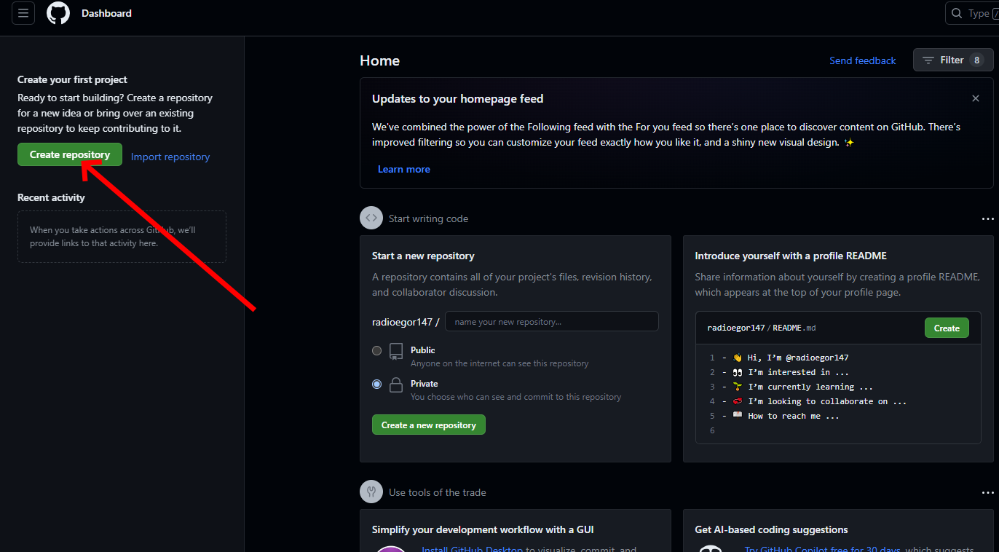

Specify the name of repository and mark it private, if you don't want to make your .jar and .dll public

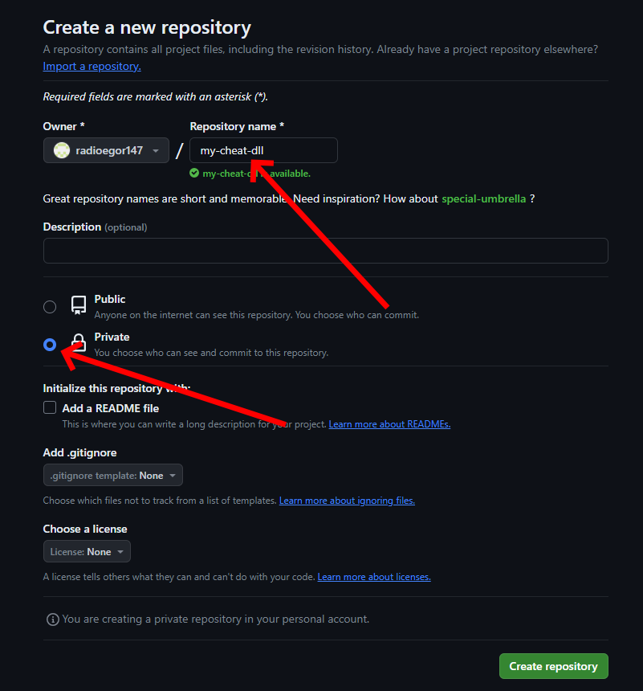

### Import code from this repository

Click `Import` to import

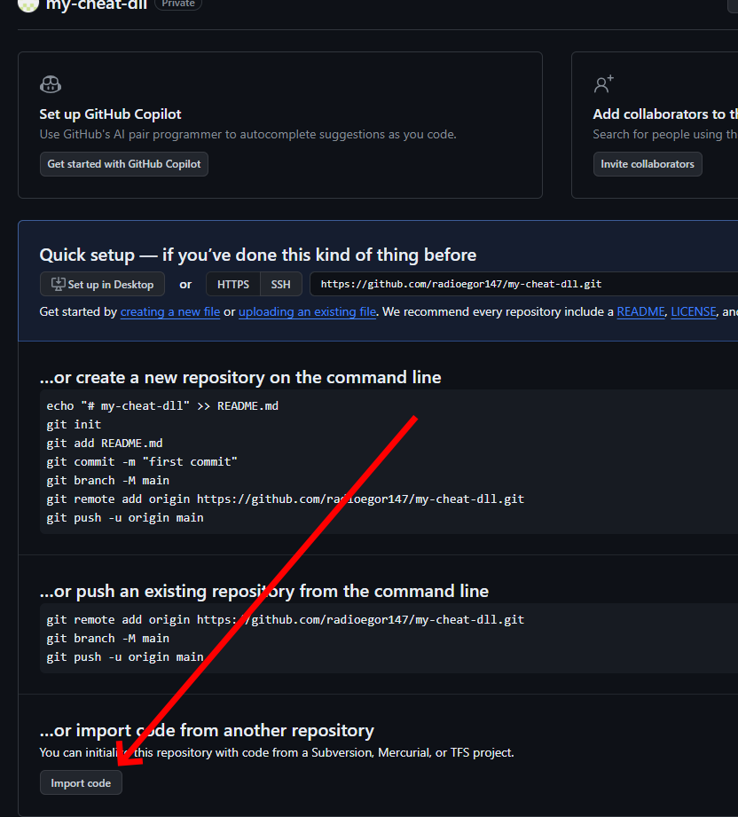

Specify this repository URL, e.g. `https://github.com/radioegor146/jar-to-dll`

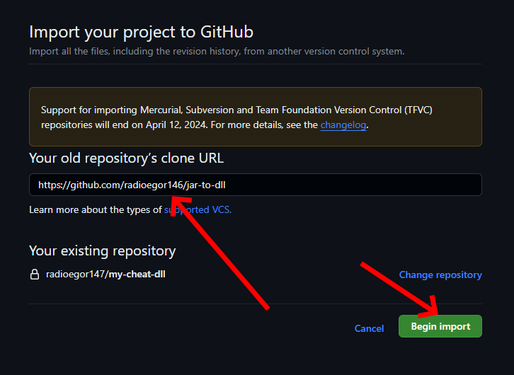

Wait for import to complete 

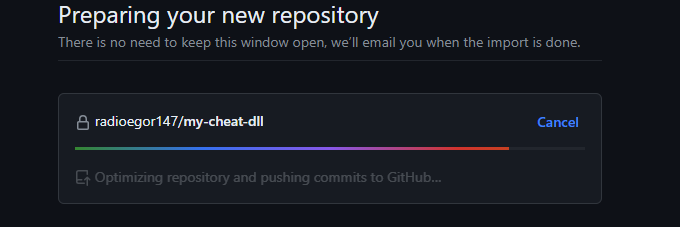

After completion go to your repository

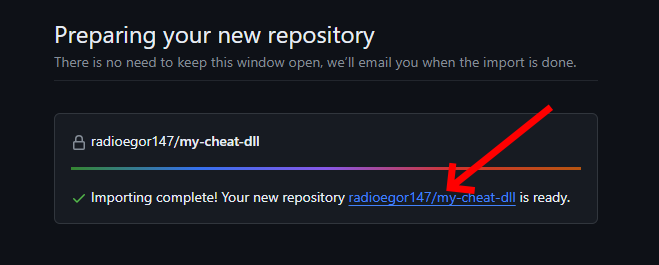

### Allow GitHub Actions

Navigate to `Settings` tab

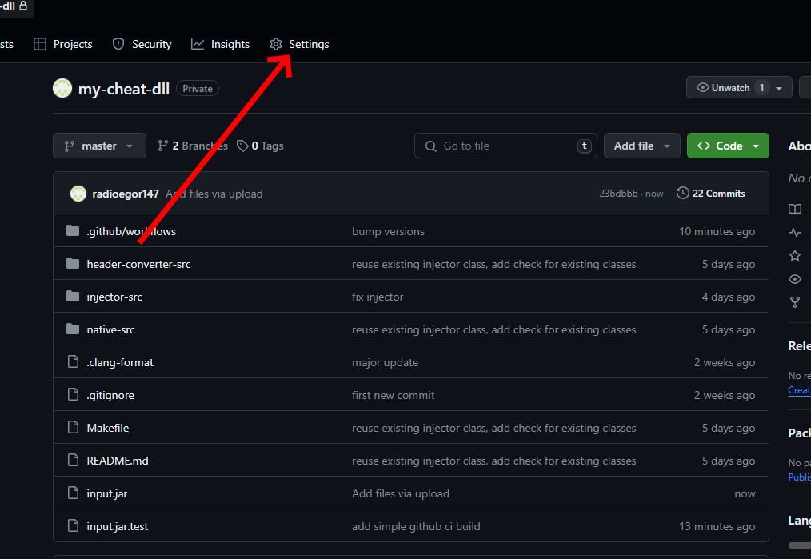

Open `Actions` menu

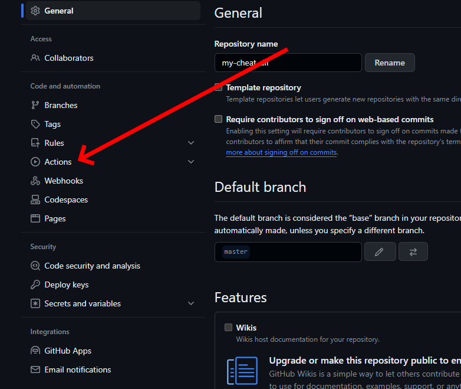

Click on `General`

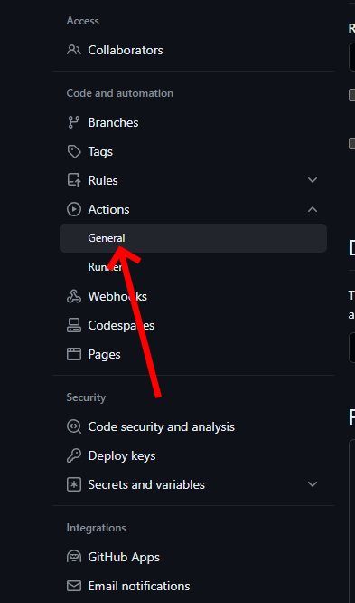

Allow all actions to be run

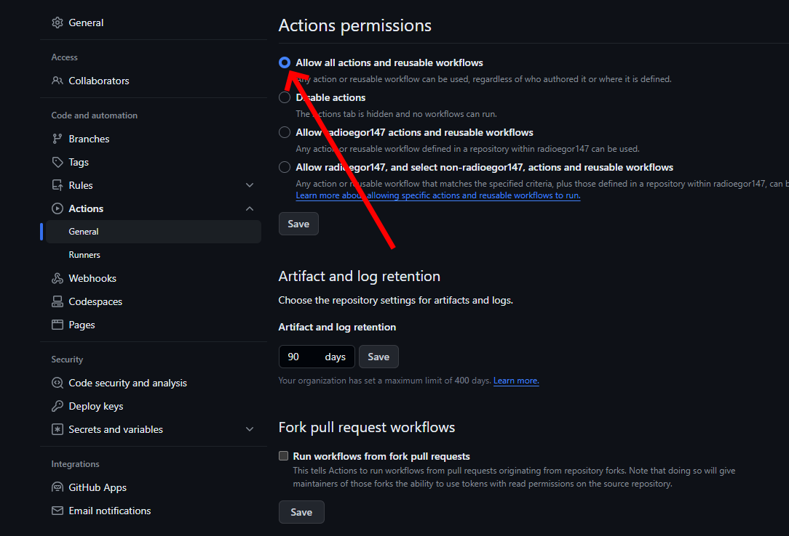

### Enable GitHub Actions

Navigate to `Actions` tab

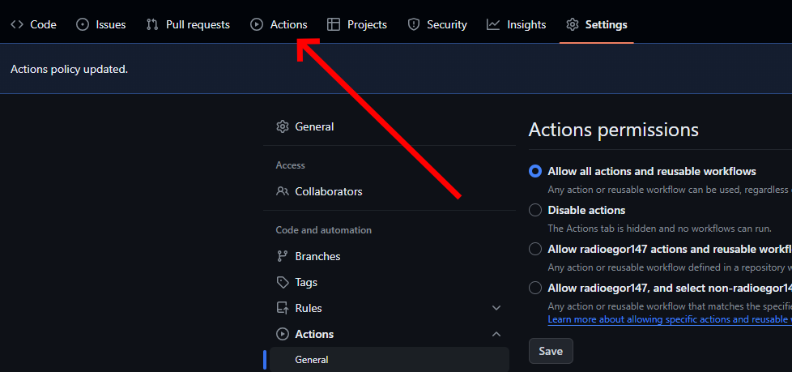

Click `Enable Actions on this repository` to enable actions

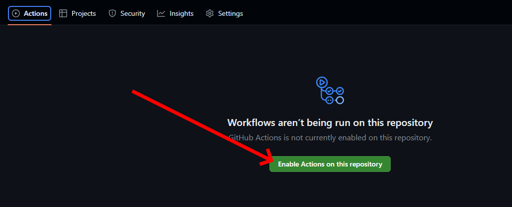

### Upload your .jar file and build .dll

Navigate to `Code` tab

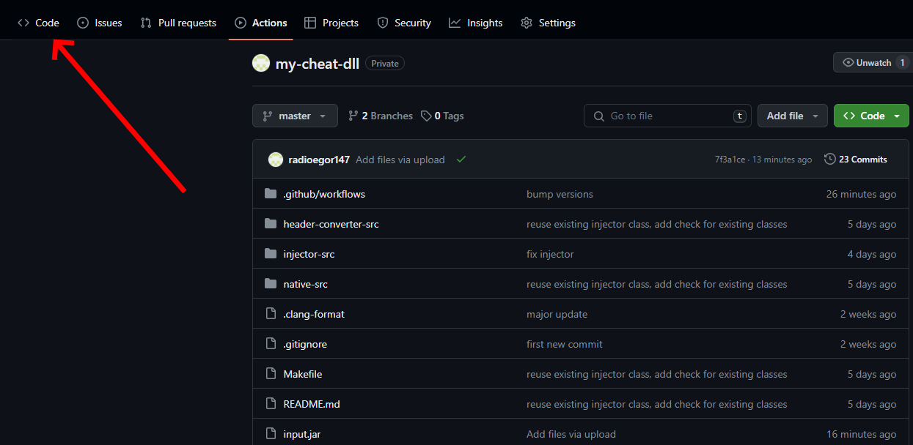

Open `Add file` menu

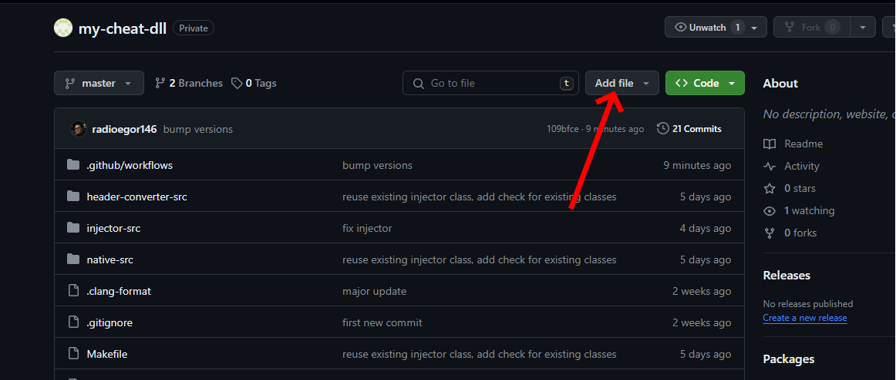

Click `Upload files` to upload your .jar file

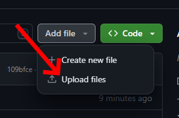

Rename your .jar file on your computer to `input.jar` (IMPORTANT!) and drag-and-drop it here

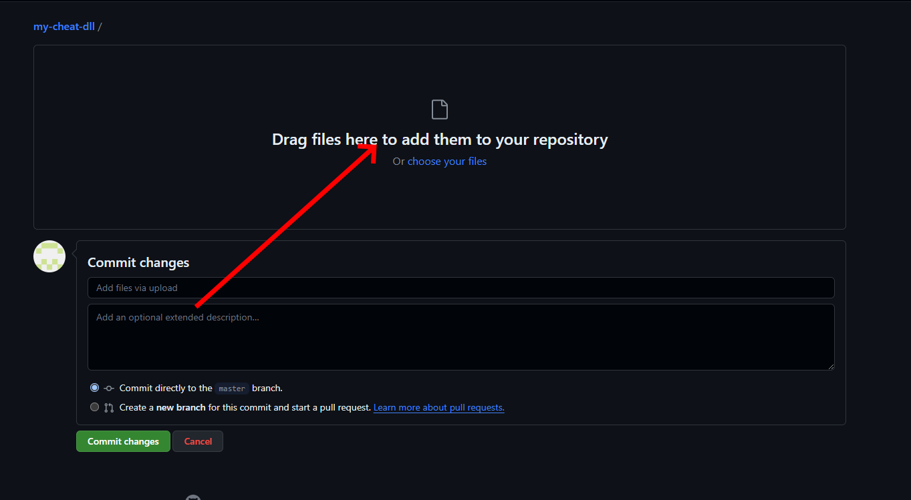

Ensure that it is uploaded and click `Commit changes`

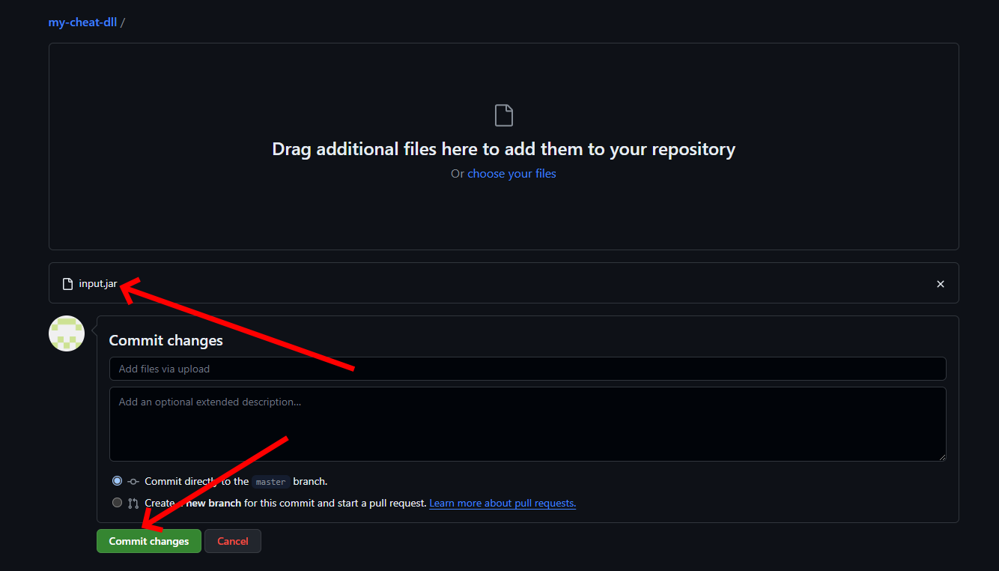

How that the file is uploaded, navigate to `Actions` tab

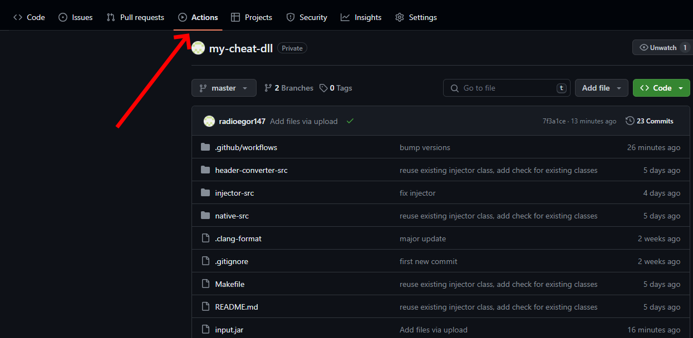

Here, click on the running workflow

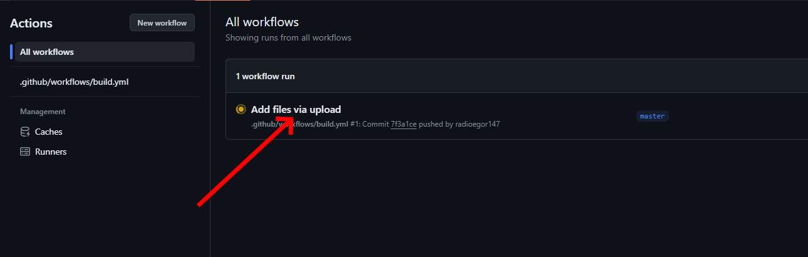

Wait for action to complete

Refresh page and verify that there are no warnings. Now you can download you .dll file and use it as you want!

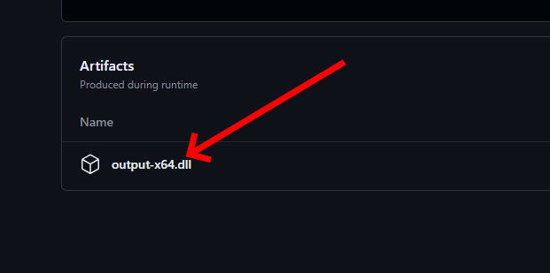